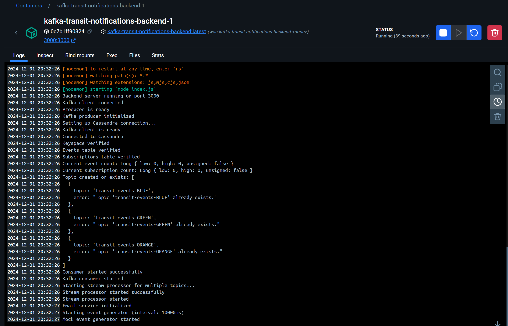

# Kafka Transit Notification System

A real-time public transportation monitoring and notification system built with modern web technologies. The system tracks transit lines, processes events in real-time, and provides instant notifications about delays, cancellations, and service disruptions.

## Features

- Real-time transit event monitoring
- Live service health dashboard
- Station-specific event tracking
- Email notifications for service disruptions
- Incident Reporting

## Technology Stack

### Backend
- Node.js + Express
- Apache Kafka for event streaming
- Apache Cassandra for event storage
- Docker & Docker Compose

### Frontend
- Next.js 13+
- Tailwind CSS
- shadcn/ui components
- Server-Sent Events (SSE) for real-time updates

## Prerequisites

- Docker and Docker Compose
- Node.js 18+ and npm
- Git

## Installation & Setup

1. Clone the repository:
```bash
git clone <https://github.com/luanled/transit-notification>
cd transit-notification
```

2. Create environment files:

Create `.env` in the root directory:
```env
NODE_ENV=development
CASSANDRA_HOST=cassandra
CASSANDRA_PORT=9042
CASSANDRA_KEYSPACE=transit_system
CASSANDRA_DC=datacenter1
CASSANDRA_USERNAME=cassandra
CASSANDRA_PASSWORD=cassandra
```

3. Start the Docker containers:
```bash
docker-compose up -d
```

This will start:
- Kafka broker
- Zookeeper
- Cassandra database
- Kafka UI (available at http://localhost:8989)

4. Install backend dependencies:
```bash
cd backend
npm install
```

5. Install frontend dependencies:
```bash
cd frontend
npm install
```

## Running the Application

1. Start the backend server:
```bash
cd backend
npm start
```
The backend will be available at http://localhost:3000

2. Start the frontend development server:
```bash
cd frontend
npm run dev
```
The frontend will be available at http://localhost:8080

## Development Tools

- Kafka UI: http://localhost:8989
  - Monitor Kafka topics, consumers, and messages
- Backend API Documentation: http://localhost:3000
  - Lists all available API endpoints

## Architecture Overview

### Event Flow
1. Events are generated by the mock event generator (in development) or real transit system
2. Events are published to Kafka topics based on transit lines (BLUE, GREEN, ORANGE)
3. Stream processor consumes events and updates real-time analytics
4. Events are stored in Cassandra for persistence
5. Frontend receives updates via SSE connection

### Data Storage
- Cassandra stores all transit events and subscriber information
- Events are partitioned by transit line for efficient querying
- Subscription data is indexed by station for quick notification processing

## Docker Commands

```bash
# Start all services
docker-compose up -d

# View logs
docker-compose logs -f

# Stop all services
docker-compose down

# Rebuild services
docker-compose up -d --build

# Remove volumes (will delete all data)
docker-compose down -v
```


